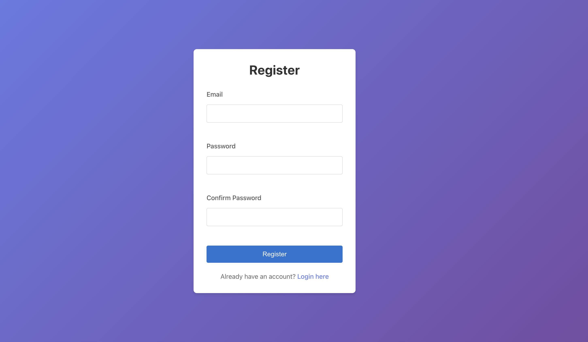
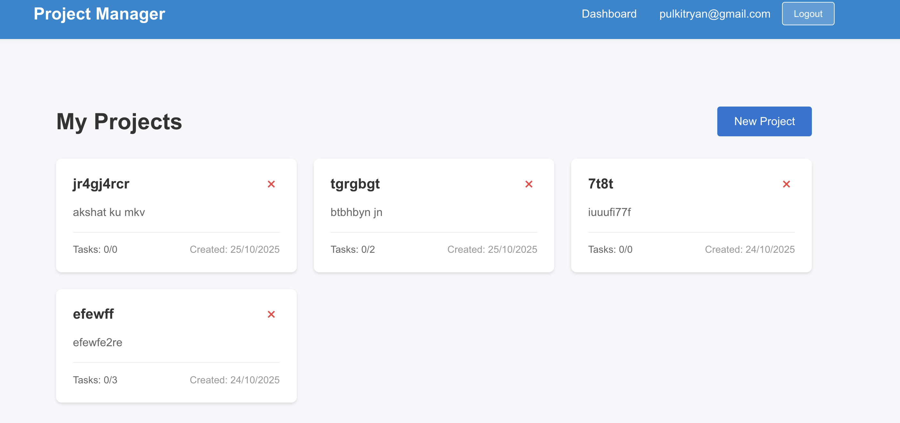
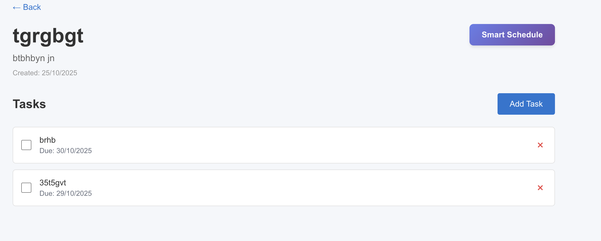
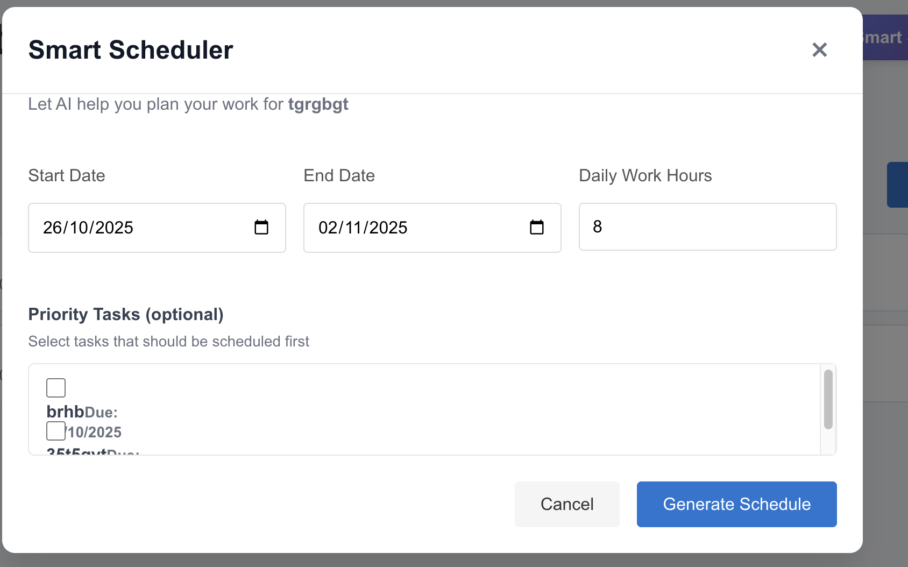

# Mini Project Manager with Smart Scheduler

A modern, full-stack web application to help users manage their projects and tasks, featuring user authentication, RESTful APIs, and an intelligent scheduling assistant that automatically plans work across days for best productivity.

## 🚀 Demo

**Frontend Demo:** _[[Vercel Deployed Frontend](https://mini-project-manager-mu.vercel.app/register)]_  
**Backend Demo:** _[Your Render/Azure/Heroku backend URL here]_

---

## 📚 Table of Contents

- [Features](#features)
- [Screenshots](#screenshots)
- [Tech Stack](#tech-stack)
- [API Reference](#api-reference)
- [Setup (Local Development)](#setup-local-development)
- [Environment Variables](#environment-variables)
- [Folder Structure](#folder-structure)


---

## Features

- **User Authentication:** Register, login, and secure JWT-protected routes.
- **Project Management:** Create, edit, and delete projects.
- **Task System:** Add, complete, edit, and remove tasks within projects.
- **Smart Scheduler:** Generate AI-assisted work schedules for your project, prioritizing urgent tasks and fitting everything within your available days/hours.
- **Responsive Design:** Fully mobile-friendly UI.
- **RESTful APIs:** Well-documented endpoints for all main data operations.
- **Modern UI:** Clean, professional design and color palette.

---

## Screenshots


<!-- > [Dashoard Screenshot](images/projects_dashboard.png) -->
- **Register page**
>
- **Project Dashboard** 
>
- **Project Pagewith added tasks**
>
- **Smart Scheduler API**
>


---

## Tech Stack

- **Frontend:** React, TypeScript, Axios, Formik, Yup, CSS Modules
- **Backend:** ASP.NET Core Web API, EF Core, SQLite
- **Auth:** JWT (JSON Web Token)
- **Hosting:** Vercel (Frontend)

---

##  API Reference

### **Authentication**

| Endpoint                   | Method | Request Body                              | Response                    |
|----------------------------|--------|-------------------------------------------|-----------------------------|
| /api/auth/register         | POST   | `{ email, password }`                     | `{ token, email, userId }`  |
| /api/auth/login            | POST   | `{ email, password }`                     | `{ token, email, userId }`  |

### **Projects**

| Endpoint                             | Method | Protected | Request Body             | Response                        |
|-------------------------------------- |--------|-----------|--------------------------|----------------------------------|
| /api/projects                        | GET    | Yes       |  -                       | `[projects]`                     |
| /api/projects/{id}                   | GET    | Yes       |  -                       | `project`                        |
| /api/projects                        | POST   | Yes       | `{ title, description }` | `project`                        |
| /api/projects/{id}                   | PUT    | Yes       | `{ title, description }` | `project`                        |
| /api/projects/{id}                   | DELETE | Yes       |  -                       | 204 No Content                   |

### **Tasks**

| Endpoint                                   | Method | Protected | Request Body                           | Response        |
|--------------------------------------------|--------|-----------|----------------------------------------|-----------------|
| /api/tasks/project/{projectId}             | GET    | Yes       |  -                                     | `[tasks]`       |
| /api/tasks                                 | POST   | Yes       | `{ title, dueDate, projectId }`        | `task`          |
| /api/tasks/{id}                            | PUT    | Yes       | `{ title, dueDate, isCompleted }`      | `task`          |
| /api/tasks/{id}/toggle                     | PATCH  | Yes       |  -                                     | `task`          |
| /api/tasks/{id}                            | DELETE | Yes       |  -                                     | 204 No Content  |

### **Smart Scheduler**

| Endpoint                                              | Method | Protected | Request Body                                                    | Response               |
|-------------------------------------------------------|--------|-----------|---------------------------------------------------------------|------------------------|
| /api/projects/{projectId}/scheduler/schedule          | POST   | Yes       | `{ startDate, endDate, dailyWorkHours, priorityTaskIds? }`    | `scheduleResponse`     |

#### **Sample Schedule Request**
```
{
  "startDate": "2025-11-01",
  "endDate": "2025-11-07",
  "dailyWorkHours": 6,
  "priorityTaskIds":[1][2]
}
```

#### **Sample ScheduleResponse**
```
{
  "projectId": 2,
  "projectTitle": "AI Research",
  "startDate": "2025-11-01",
  "endDate": "2025-11-07",
  "totalTasks": 5,
  "scheduledTasks": 5,
  "schedule": [
    {
      "taskId": 12,
      "title": "Draft Paper",
      "scheduledDate": "2025-11-01",
      "estimatedHours": 6,
      "priority": "High",
      "reason": "User marked as priority"
    }
    // ...
  ],
  "warnings": []
}
```

---

## Setup (Local Development)

### **1. Clone the repository**

```
git clone https://github.com/yourusername/mini-project-manager.git
cd mini-project-manager
```

### **2. Backend Setup**

```
cd backend
dotnet restore
dotnet ef database update
dotnet run
```

- Server runs on http://localhost:5000 by default.

### **3. Frontend Setup**

```
cd ../frontend
npm install
cp .env.example .env   # Fill in REACT_APP_API_URL as http://localhost:5000/api for local dev
npm start
```

- App runs on http://localhost:3000 by default.

---


### **CORS Note:**  
Update backend CORS policy to allow traffic from both `localhost:3000` and your Vercel domain.

---

## Environment Variables

**Frontend (`frontend/.env`):**
```
REACT_APP_API_URL=https://your-backend-on-render.com/api
```

**Backend (`backend/appsettings.Development.json`):**
- Securely store your JWT secret keys and DB connection here.  
- Do **not** commit real secrets to git.

---

## Folder Structure

```
mini-project-manager/
├── backend/
│   └── Controllers/
│   └── Models/
│   └── Services/
│   └── Data/
│   └── ...
├── frontend/
│   └── src/
│       └── components/
│       └── pages/
│       └── services/
│       └── context/
│       └── types/
│       └── ...
│   └── public/
│   └── package.json
├── .gitignore
├── README.md
```

---


